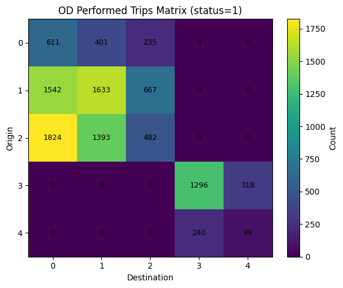
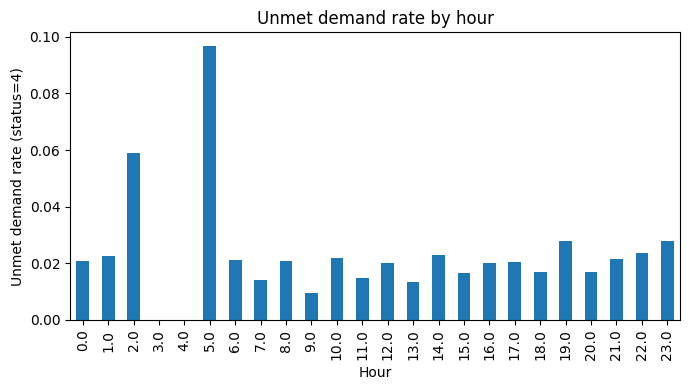
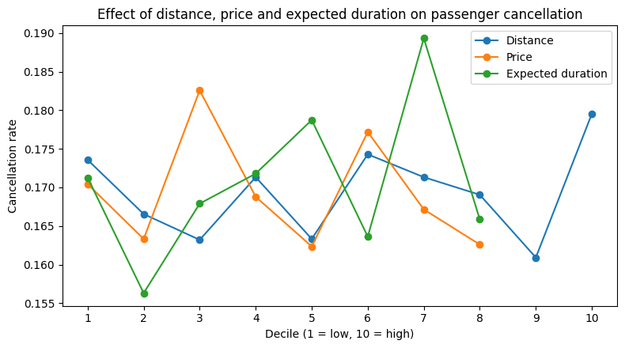
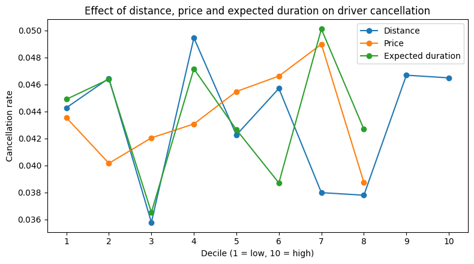

# Part 1: Demand, Supply and Pricing Analysis

Notebook: [`part1_demand_supply_and_pricing.ipynb`](part1_demand_supply_and_pricing.ipynb) (English) | [`part1_demand_supply_and_pricing_FA.ipynb`](part1_demand_supply_and_pricing_FA.ipynb) (original, Persian)

## Business questions

1. Where does demand come from and go to, and which routes matter most?
2. How much demand is lost because no driver accepts the trip, and when does this happen?
3. How do request volume, fares and discounts change during the day?
4. Are passenger and driver cancellations linked to trip distance, price or expected duration?

## Approach

- Kept only real ride requests (a request time is recorded) and removed invalid records (missing or non-positive price, distance or duration; negative discount). This leaves 16,253 of the 26,768 price checks.
- Removed outliers with the IQR rule (1.5 x IQR) on price, distance, expected duration and price per km. 13,974 requests remain.
- Created business features: price after discount, discount-to-price ratio, price per km, and hour of request.
- Built origin-destination (OD) matrices for all requests and for completed trips (status = 1).
- Measured the unmet demand rate (share of requests with status = 4, "no driver accepted") overall and by hour.
- Ranked OD pairs by share of demand and by volatility (standard deviation) of price per km.
- Compared the average discount-to-price ratio in peak hours (06:00-08:59 and 16:00-19:59) with off-peak hours.
- Split distance, price and expected duration into deciles and computed the cancellation rate in each decile, once for passenger cancellations (status = 2) and once for driver cancellations (status = 3).

## Results

### 1. Demand is concentrated on a few routes

| OD demand (all requests) | OD completed trips (status = 1) |
|---|---|
|  |  |

- The five busiest OD pairs carry 71.2% of all cleaned requests.

| Origin | Destination | Share of demand |
|---|---|---|
| 2 | 0 | 16.91% |
| 1 | 1 | 15.06% |
| 1 | 0 | 14.13% |
| 2 | 1 | 13.00% |
| 3 | 3 | 12.13% |

- Zones 0-2 and zones 3-4 form two separate groups. There are no requests between the two groups.
- Summing the two matrices, 10,730 of 13,974 requests (76.8%) became completed trips. The gap between the two matrices shows, route by route, how much demand was lost to cancellations or to no driver being found.

### 2. Unmet demand (no driver found) is low overall but higher late at night

- Overall unmet demand rate: **1.95%** of requests.
- The highest hourly rates are at 05:00 (9.7%) and 02:00 (5.9%). These hours have very few requests (31 and 51), so a few unmatched requests move the rate a lot.
- Between 06:00 and 23:59 the rate stays between about 1% and 2.8%.

### 3. Price-per-km volatility differs by route

The ten OD pairs (with at least 30 requests) with the highest standard deviation of price per km:

| Origin | Destination | Mean price per km | Std of price per km | Requests |
|---|---|---|---|---|
| 0 | 2 | 18,334 | 6,865 | 303 |
| 4 | 4 | 22,161 | 6,603 | 119 |
| 3 | 3 | 16,801 | 6,015 | 1,695 |
| 1 | 0 | 22,628 | 5,647 | 1,974 |
| 2 | 1 | 18,485 | 5,616 | 1,817 |
| 0 | 0 | 17,272 | 5,579 | 795 |
| 1 | 2 | 16,871 | 5,336 | 870 |
| 1 | 1 | 17,624 | 4,750 | 2,105 |
| 4 | 3 | 14,872 | 4,657 | 317 |
| 3 | 4 | 13,696 | 4,524 | 413 |

Prices are in the units recorded in the dataset (the currency is not stated).

### 4. Discounts are about the same in peak and off-peak hours

- Average discount-to-price ratio in peak hours: **15.68%**.
- Average discount-to-price ratio in off-peak hours: **15.05%**.

### 5. Demand peaks in the late afternoon; fares are highest at night

| Requests by hour | Price after discount by hour (mean +/- std) |
|---|---|
|  |  |

- Busiest hour: 18:00 with 1,174 requests (17:00 is almost the same with 1,173).
- Quietest hour: 05:00 with 31 requests.
- The average fare after discount is highest between 00:00 and 05:59 (about 67,700 to 72,300). Between 09:00 and 20:59 it is about 45,200 to 51,600.
- So the average fare moves in the opposite direction to request volume. The report reads the higher night fares as a way to make low-demand night trips attractive to drivers.

### 6. Cancellation rates by distance, price and duration

| Passenger cancellations (status = 2) | Driver cancellations (status = 3) |
|---|---|
|  |  |

- Passenger cancellation rates stay between about 16% and 19% in every decile.
- Driver cancellation rates stay between about 3.6% and 5% in every decile.
- The lines for price and expected duration have fewer than 10 points because several deciles share the same value and were merged.
- Part 2 tests the price and distance effects formally.

## Takeaways for decision makers

- **Focus operations on a few routes.** Five OD pairs generate about 71% of demand. Route 2 to 0 alone is 16.9%. These routes deserve the most attention in driver supply planning.
- **Driver shortage is not the main source of lost trips.** Only 1.95% of requests found no driver. Most of the gap between requests and completed trips comes from cancellations.
- **Watch late-night supply.** The unmet demand rate is highest at 02:00 and 05:00, although request volumes then are small.
- **Discount policy is flat across the day.** Discounts average about 15% of the price in both peak and off-peak hours.
- **Fares are highest when demand is lowest.** The average fare is about 70,000 at night and about 48,000 around midday.
