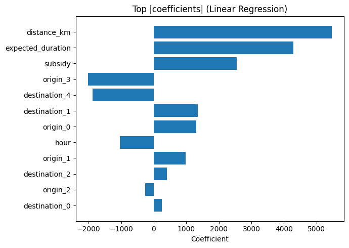
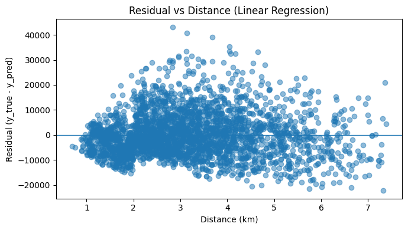
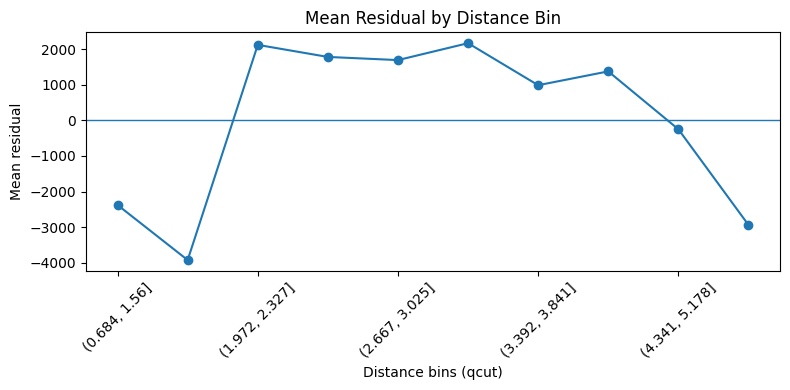
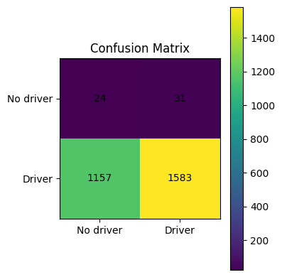

# Part 3: Price and Driver-Match Prediction

Notebook: [`part3_price_and_driver_match_prediction.ipynb`](part3_price_and_driver_match_prediction.ipynb) (English) | [`part3_price_and_driver_match_prediction_FA.ipynb`](part3_price_and_driver_match_prediction_FA.ipynb) (original, Persian)

## Business questions

1. Can the trip price be estimated from trip and time features, and which features drive it?
2. Can we predict, at request time, whether a driver will be found for a request?

## Approach

Same cleaning as Parts 1 and 2 (13,974 requests). Both models use an 80/20 train/test split (`random_state=42`).

**Price model: linear regression**
- Target: offered price (before discount).
- Numeric inputs (standardised): hour, distance (km), expected duration, discount amount.
- Categorical inputs (one-hot encoded): origin zone, destination zone.
- Metrics: MAE, RMSE, MAPE and R² on the test set, one example prediction, coefficient ranking, and residuals against distance.

**Driver-match model: logistic regression**
- Target: `accepted_by_driver = 1` if a driver was found (status is not 4), otherwise 0.
- Numeric inputs (standardised): hour, distance (km), discount amount. Categorical inputs: origin and destination zones.
- `class_weight="balanced"` because only about 2% of requests have no driver. The split is stratified by the target.
- Metrics: accuracy, precision, recall, F1, ROC-AUC, confusion matrix, and coefficients as odds ratios.

## Results

### Price model

| Metric | Value |
|---|---|
| R² | 0.594 |
| MAE | 6,824 |
| RMSE | 8,835 |
| MAPE | 11.54% |

- The model explains about 59% of the variation in price. The average error is about 11.5% of the price.
- Example from the test set: real price 50,000, predicted 59,891, an error of 19.8%. This error is larger than the MAE.

- Distance (+5,467 per standard deviation) and expected duration (+4,284) have the largest effects on price, followed by the discount amount (+2,549).
- Zone effects are smaller. Origin 3 (-2,020) and destination 4 (-1,881) are associated with lower prices. Hour has a coefficient of -1,036.

| Residual vs. distance | Mean residual by distance bin |
|---|---|
|  |  |

- Errors scatter around zero across all distances. The mean residual per distance bin stays within about +/- 4,000, which is below the MAE.
- The model slightly over-predicts the shortest trips (below about 2 km) and the longest bin, and slightly under-predicts mid-range trips.

### Driver-match model

| Metric | Value |
|---|---|
| Accuracy | 0.575 |
| Precision | 0.981 |
| Recall | 0.578 |
| F1 | 0.727 |
| ROC-AUC | 0.509 |

- ROC-AUC is close to 0.5. The model cannot separate requests that get a driver from those that do not.
- High precision mostly reflects the fact that about 98% of requests get a driver anyway.
- In the test set there are 55 requests with no driver. The model flags 24 of them, but it also flags 1,157 of the 2,740 requests that did get a driver.
- Coefficients (odds ratio per one standard deviation): discount 1.023 (slightly higher chance of a driver), distance 0.965 (slightly lower chance), hour 0.894. The largest zone effect is destination 4 (odds ratio 0.69). Given the low ROC-AUC, these effects are weak.

## Takeaways for decision makers

- **Price is mostly set by distance and expected duration.** A simple linear model with these features, zones, hour and discount explains about 59% of price variation, with an average error of about 11.5%. It can support rough fare estimates, not exact quotes.
- **Whether a driver is found cannot be predicted from these features.** Hour, distance, discount and zones do not explain the rare no-driver cases.
- **Discounts and distance have only small effects on driver matching.** In this model, a larger discount slightly raises and a longer distance slightly lowers the chance of finding a driver.
