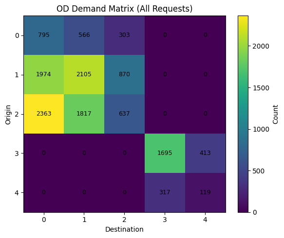
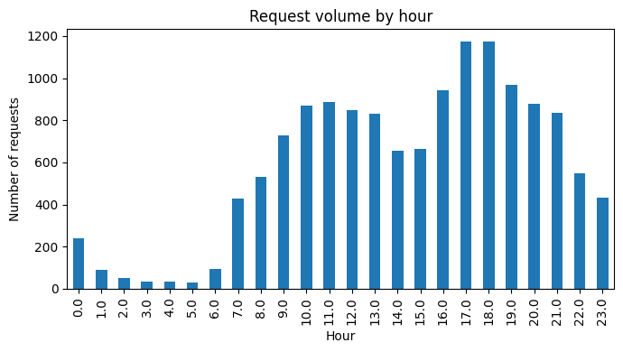
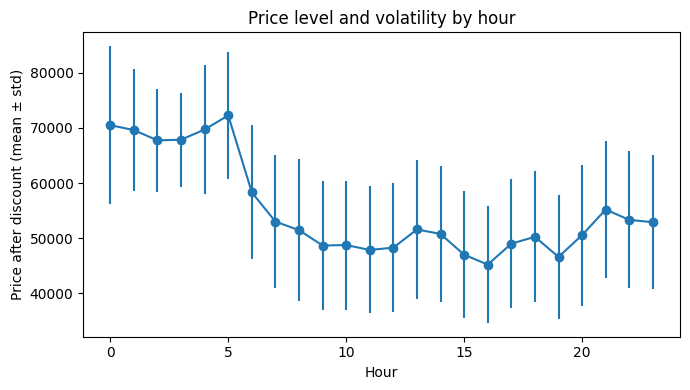

# Ride-Hailing Pricing Review: Demand, Supply, Discounts and Cancellations

An analysis of one week of real data from an online taxi (ride-hailing) app. The goal is to check how the platform's pricing has performed: where and when demand arises, how much of it is served, how fares and discounts behave, and what drives cancellations and bookings.

## At a glance

- **Business question:** How did the platform's pricing and discount system perform, and what does the data say about demand, driver supply, conversion and cancellations?
- **Data:** 26,768 price quotes from a ride-hailing app in early January 2021. 16,253 of them are valid ride requests. After outlier removal, 13,974 requests are analysed. The city is split into 5 anonymised zones (0-4).
- **What was done:** data cleaning and KPI design, origin-destination (OD) demand analysis, time-of-day demand and price analysis, cancellation analysis, hypothesis testing, and two predictive models (price and driver match).
- **Top findings:**
  1. **Demand is concentrated.** Five routes carry 71% of requests. Route 2 to 0 alone carries 16.9%.
  2. **Driver shortage is rare.** Only 1.95% of requests found no driver. 76.8% of requests became completed trips; most of the rest were cancellations.
  3. **Fares are highest when demand is lowest.** Average fares are about 68,000-72,000 between 00:00 and 05:59, and about 45,000-52,000 between 09:00 and 20:59. Demand peaks at 17:00-18:00 (about 1,170 requests per hour).
  4. **Discounts did not change conversion.** About 88% of price quotes carried a discount, and on ride requests the discount averaged about 15% of the price. The quote-to-request rate was 62.5% with a discount and 62.7% without (p = 0.84).
  5. **Price is predictable, driver matching is not.** A linear model explains 59% of price variation (average error 11.5%), led by distance and expected duration. A model for "driver found" performs close to chance (ROC-AUC 0.51).

## Course and authors

- **Instructor:** Dr. Sadeghi
- **Course:** Transportation Planning, Logistics and Supply Chain
- **Department:** Industrial Engineering, Amirkabir University of Technology (Tehran Polytechnic)
- **Author:** Paniz Otaghi (team project of two students)
- **Term:** Autumn 2025

## Business questions and findings

### 1. Where is demand, and how much of it is served?



- The five busiest OD pairs (2 to 0, 1 to 1, 1 to 0, 2 to 1, 3 to 3) carry 71.2% of requests.
- Zones 0-2 and zones 3-4 behave as two separate markets. There are no requests between them.
- 10,730 of 13,974 requests (76.8%) became completed trips.
- The unmet demand rate (no driver accepted) is 1.95%. It is highest at 05:00 (9.7%) and 02:00 (5.9%), hours with very few requests (31 and 51).

### 2. How do demand and price change during the day?

| Requests by hour | Average fare after discount by hour (mean +/- std) |
|---|---|
|  |  |

- Demand is lowest at 05:00 (31 requests) and highest at 18:00 (1,174) and 17:00 (1,173).
- The average fare moves in the opposite direction. It is highest at night and lowest in the afternoon (45,239 at 16:00).
- The report reads the higher night fares as a way to make low-demand night trips attractive to drivers.
- Price per km is most volatile on route 0 to 2 (standard deviation 6,865 around a mean of 18,334).

### 3. Do discounts pay off?

- The average discount is 15.68% of the price in peak hours and 15.05% off-peak. The discount level is almost flat across the day.
- About 88% of price quotes (21,677 of 24,723) included a discount.
- Quotes with a discount converted to ride requests at 62.5%. Quotes without a discount converted at 62.7%. Fisher's exact test: p = 0.84, odds ratio 0.99. No significant difference.

### 4. What drives cancellations?

- In every decile of distance, price and expected duration, the passenger cancellation rate is about 16-19% and the driver cancellation rate about 3.6-5%. There is no clear upward or downward trend.
- Passengers who cancelled saw almost the same average price as others (50,431 vs. 50,457; Welch's t-test p = 0.93).
- Trips cancelled by drivers were almost the same length as other trips (3.21 km vs. 3.19 km; p = 0.72).
- The report concludes that cancellations are likely driven by factors other than price, distance and discount.

### 5. Can we predict price and driver matching?


- **Price model (linear regression):** R² = 0.594, MAE = 6,824, RMSE = 8,835, MAPE = 11.54%. Distance and expected duration have the largest effects on price.
- **Driver-match model (logistic regression):** accuracy 0.575, ROC-AUC 0.509. The model cannot tell in advance which requests will fail to find a driver.

Prices are in the units recorded in the dataset (the currency is not stated).

## Recommendations

These follow from the findings above and from the conclusions in the project report.

1. **Plan supply around the top routes.** Five OD pairs generate 71% of demand. The report stresses that these high-demand areas need the most careful management and planning.
2. **Treat cancellations, not driver shortage, as the main leakage.** Unmatched requests are about 2%, while cancellations account for most of the gap between requests and completed trips.
3. **Review the blanket discount.** Discounts are applied to most quotes at a similar level all day, but they were not linked to higher conversion in this data.
4. **Design pricing and dispatch for passengers and drivers separately.** The report notes that passengers and drivers follow different logic when they cancel, and that ignoring this can reduce satisfaction on both sides.
5. **Use the price model for rough estimates only, and do not use the driver-match model for decisions.** Its performance is close to chance.

## Project structure

| Folder | Business focus | Contents |
|---|---|---|
| [`Part_1_Demand_Supply_and_Pricing/`](Part_1_Demand_Supply_and_Pricing/) | OD demand, unmet demand, time-of-day demand and fares, discount levels, cancellation patterns | [README](Part_1_Demand_Supply_and_Pricing/README.md), [notebook](Part_1_Demand_Supply_and_Pricing/part1_demand_supply_and_pricing.ipynb), figures |
| [`Part_2_Passenger_and_Driver_Behaviour/`](Part_2_Passenger_and_Driver_Behaviour/) | Effect of price, distance and discounts on cancellations and conversion (hypothesis tests) | [README](Part_2_Passenger_and_Driver_Behaviour/README.md), [notebook](Part_2_Passenger_and_Driver_Behaviour/part2_passenger_and_driver_behaviour.ipynb) |
| [`Part_3_Price_and_Driver_Match_Prediction/`](Part_3_Price_and_Driver_Match_Prediction/) | Price prediction and "driver found" prediction | [README](Part_3_Price_and_Driver_Match_Prediction/README.md), [notebook](Part_3_Price_and_Driver_Match_Prediction/part3_price_and_driver_match_prediction.ipynb), figures |
| [`data/`](data/) | Raw dataset | [`data.csv`](data/data.csv) |
| [`report/`](report/) | Project report | [English summary](report/Report_Summary_EN.md), [original report (Persian PDF)](report/Project_Report_FA.pdf) |

### Data dictionary

| Column | Meaning |
|---|---|
| `price_check_time` | Time the passenger asked for a price quote |
| `passenger` | Passenger ID |
| `origin`, `destination` | Origin and destination zone IDs (0-4) |
| `price` | Offered price before discount |
| `subsidy` | Discount amount |
| `distance` | Trip distance (metres) |
| `expected_duration` | Estimated trip duration (minutes) |
| `req_time` | Time the ride request was sent (empty if the passenger did not book) |
| `driver` | ID of the driver who accepted |
| `status` | 1 = completed, 2 = cancelled by passenger, 3 = cancelled by driver, 4 = no driver accepted, empty = no request |

## Skills and methods

- **Data preparation:** time parsing, validity filters, IQR outlier removal, feature engineering (price after discount, discount ratio, price per km, hour of day).
- **KPI design:** completion rate, unmet demand rate, quote-to-request conversion, demand share by route, discount-to-price ratio, cancellation rates.
- **Descriptive analytics:** origin-destination matrices and heatmaps, hourly demand and price profiles, decile analysis.
- **Statistics:** distribution fitting compared by AIC (normal, lognormal, gamma, exponential), Welch's t-test, Fisher's exact test, odds ratios.
- **Predictive modelling:** scikit-learn pipelines with `StandardScaler` and `OneHotEncoder`, linear regression, logistic regression with class weighting, stratified train/test split.
- **Model evaluation:** MAE, RMSE, MAPE, R², accuracy, precision, recall, F1, ROC-AUC, confusion matrix, residual analysis, coefficient interpretation.

## Tools

Python, pandas, NumPy, Matplotlib, SciPy, scikit-learn, Jupyter.

## How to run

```bash
pip install -r requirements.txt
jupyter notebook
```

Open any notebook in the `Part_*` folders and run all cells. Each notebook reads the data from `../data/data.csv`. The notebooks were last executed with Python 3.11, pandas 3.0 and scikit-learn 1.8.

## Language note

The project was originally written in Persian. This repository contains:

- English notebooks, translated from the originals. Markdown text is translated and all outputs are in English. The code logic is the same as in the originals.
- The original Persian notebooks, kept next to the English ones with the suffix `_FA` (for example `part1_demand_supply_and_pricing_FA.ipynb`).
- The original Persian report, [`report/Project_Report_FA.pdf`](report/Project_Report_FA.pdf), and an English summary of it, [`report/Report_Summary_EN.md`](report/Report_Summary_EN.md).
# Ride-Hailing Pricing Review: Demand, Supply, Discounts and Cancellations

An analysis of one week of real data from an online taxi (ride-hailing) app. The goal is to check how the platform's pricing has performed: where and when demand arises, how much of it is served, how fares and discounts behave, and what drives cancellations and bookings.

## At a glance

- **Business question:** How did the platform's pricing and discount system perform, and what does the data say about demand, driver supply, conversion and cancellations?
- **Data:** 26,768 price quotes from a ride-hailing app in early January 2021. 16,253 of them are valid ride requests. After outlier removal, 13,974 requests are analysed. The city is split into 5 anonymised zones (0-4).
- **What was done:** data cleaning and KPI design, origin-destination (OD) demand analysis, time-of-day demand and price analysis, cancellation analysis, hypothesis testing, and two predictive models (price and driver match).
- **Top findings:**
  1. **Demand is concentrated.** Five routes carry 71% of requests. Route 2 to 0 alone carries 16.9%.
  2. **Driver shortage is rare.** Only 1.95% of requests found no driver. 76.8% of requests became completed trips; most of the rest were cancellations.
  3. **Fares are highest when demand is lowest.** Average fares are about 68,000-72,000 between 00:00 and 05:59, and about 45,000-52,000 between 09:00 and 20:59. Demand peaks at 17:00-18:00 (about 1,170 requests per hour).
  4. **Discounts did not change conversion.** About 88% of price quotes carried a discount, and on ride requests the discount averaged about 15% of the price. The quote-to-request rate was 62.5% with a discount and 62.7% without (p = 0.84).
  5. **Price is predictable, driver matching is not.** A linear model explains 59% of price variation (average error 11.5%), led by distance and expected duration. A model for "driver found" performs close to chance (ROC-AUC 0.51).

## Course and authors

- **Course:** Transportation Planning, Logistics and Supply Chain (B.Sc. course project)
- **Instructor:** Dr. Sadeghi
- **Department:** Industrial Engineering, Amirkabir University of Technology (Tehran Polytechnic)
- **Author:** Paniz Otaghi (team project of two students)
- **Term:** Autumn 2025

## Business questions and findings

### 1. Where is demand, and how much of it is served?


- The five busiest OD pairs (2 to 0, 1 to 1, 1 to 0, 2 to 1, 3 to 3) carry 71.2% of requests.
- Zones 0-2 and zones 3-4 behave as two separate markets. There are no requests between them.
- 10,730 of 13,974 requests (76.8%) became completed trips.
- The unmet demand rate (no driver accepted) is 1.95%. It is highest at 05:00 (9.7%) and 02:00 (5.9%), hours with very few requests (31 and 51).

### 2. How do demand and price change during the day?

| Requests by hour | Average fare after discount by hour (mean +/- std) |
|---|---|
|  |  |

- Demand is lowest at 05:00 (31 requests) and highest at 18:00 (1,174) and 17:00 (1,173).
- The average fare moves in the opposite direction. It is highest at night and lowest in the afternoon (45,239 at 16:00).
- The report reads the higher night fares as a way to make low-demand night trips attractive to drivers.
- Price per km is most volatile on route 0 to 2 (standard deviation 6,865 around a mean of 18,334).

### 3. Do discounts pay off?

- The average discount is 15.68% of the price in peak hours and 15.05% off-peak. The discount level is almost flat across the day.
- About 88% of price quotes (21,677 of 24,723) included a discount.
- Quotes with a discount converted to ride requests at 62.5%. Quotes without a discount converted at 62.7%. Fisher's exact test: p = 0.84, odds ratio 0.99. No significant difference.

### 4. What drives cancellations?

- In every decile of distance, price and expected duration, the passenger cancellation rate is about 16-19% and the driver cancellation rate about 3.6-5%. There is no clear upward or downward trend.
- Passengers who cancelled saw almost the same average price as others (50,431 vs. 50,457; Welch's t-test p = 0.93).
- Trips cancelled by drivers were almost the same length as other trips (3.21 km vs. 3.19 km; p = 0.72).
- The report concludes that cancellations are likely driven by factors other than price, distance and discount.

### 5. Can we predict price and driver matching?


- **Price model (linear regression):** R² = 0.594, MAE = 6,824, RMSE = 8,835, MAPE = 11.54%. Distance and expected duration have the largest effects on price.
- **Driver-match model (logistic regression):** accuracy 0.575, ROC-AUC 0.509. The model cannot tell in advance which requests will fail to find a driver.

Prices are in the units recorded in the dataset (the currency is not stated).

## Recommendations

These follow from the findings above and from the conclusions in the project report.

1. **Plan supply around the top routes.** Five OD pairs generate 71% of demand. The report stresses that these high-demand areas need the most careful management and planning.
2. **Treat cancellations, not driver shortage, as the main leakage.** Unmatched requests are about 2%, while cancellations account for most of the gap between requests and completed trips.
3. **Review the blanket discount.** Discounts are applied to most quotes at a similar level all day, but they were not linked to higher conversion in this data.
4. **Design pricing and dispatch for passengers and drivers separately.** The report notes that passengers and drivers follow different logic when they cancel, and that ignoring this can reduce satisfaction on both sides.
5. **Use the price model for rough estimates only, and do not use the driver-match model for decisions.** Its performance is close to chance.

## Project structure

| Folder | Business focus | Contents |
|---|---|---|
| [`Part_1_Demand_Supply_and_Pricing/`](Part_1_Demand_Supply_and_Pricing/) | OD demand, unmet demand, time-of-day demand and fares, discount levels, cancellation patterns | [README](Part_1_Demand_Supply_and_Pricing/README.md), [notebook](Part_1_Demand_Supply_and_Pricing/part1_demand_supply_and_pricing.ipynb), figures |
| [`Part_2_Passenger_and_Driver_Behaviour/`](Part_2_Passenger_and_Driver_Behaviour/) | Effect of price, distance and discounts on cancellations and conversion (hypothesis tests) | [README](Part_2_Passenger_and_Driver_Behaviour/README.md), [notebook](Part_2_Passenger_and_Driver_Behaviour/part2_passenger_and_driver_behaviour.ipynb) |
| [`Part_3_Price_and_Driver_Match_Prediction/`](Part_3_Price_and_Driver_Match_Prediction/) | Price prediction and "driver found" prediction | [README](Part_3_Price_and_Driver_Match_Prediction/README.md), [notebook](Part_3_Price_and_Driver_Match_Prediction/part3_price_and_driver_match_prediction.ipynb), figures |
| [`data/`](data/) | Raw dataset | [`data.csv`](data/data.csv) |
| [`report/`](report/) | Project report | [English summary](report/Report_Summary_EN.md), [original report (Persian PDF)](report/Project_Report_FA.pdf) |

### Data dictionary

| Column | Meaning |
|---|---|
| `price_check_time` | Time the passenger asked for a price quote |
| `passenger` | Passenger ID |
| `origin`, `destination` | Origin and destination zone IDs (0-4) |
| `price` | Offered price before discount |
| `subsidy` | Discount amount |
| `distance` | Trip distance (metres) |
| `expected_duration` | Estimated trip duration (minutes) |
| `req_time` | Time the ride request was sent (empty if the passenger did not book) |
| `driver` | ID of the driver who accepted |
| `status` | 1 = completed, 2 = cancelled by passenger, 3 = cancelled by driver, 4 = no driver accepted, empty = no request |

## Skills and methods

- **Data preparation:** time parsing, validity filters, IQR outlier removal, feature engineering (price after discount, discount ratio, price per km, hour of day).
- **KPI design:** completion rate, unmet demand rate, quote-to-request conversion, demand share by route, discount-to-price ratio, cancellation rates.
- **Descriptive analytics:** origin-destination matrices and heatmaps, hourly demand and price profiles, decile analysis.
- **Statistics:** distribution fitting compared by AIC (normal, lognormal, gamma, exponential), Welch's t-test, Fisher's exact test, odds ratios.
- **Predictive modelling:** scikit-learn pipelines with `StandardScaler` and `OneHotEncoder`, linear regression, logistic regression with class weighting, stratified train/test split.
- **Model evaluation:** MAE, RMSE, MAPE, R², accuracy, precision, recall, F1, ROC-AUC, confusion matrix, residual analysis, coefficient interpretation.

## Tools

Python, pandas, NumPy, Matplotlib, SciPy, scikit-learn, Jupyter.

## How to run

```bash
pip install -r requirements.txt
jupyter notebook
```

Open any notebook in the `Part_*` folders and run all cells. Each notebook reads the data from `../data/data.csv`. The notebooks were last executed with Python 3.11, pandas 3.0 and scikit-learn 1.8.

## Language note

The project was originally written in Persian. This repository contains:

- English notebooks, translated from the originals. Markdown text is translated and all outputs are in English. The code logic is the same as in the originals.
- The original Persian notebooks, kept next to the English ones with the suffix `_FA` (for example `part1_demand_supply_and_pricing_FA.ipynb`).
- The original Persian report, [`report/Project_Report_FA.pdf`](report/Project_Report_FA.pdf), and an English summary of it, [`report/Report_Summary_EN.md`](report/Report_Summary_EN.md).
